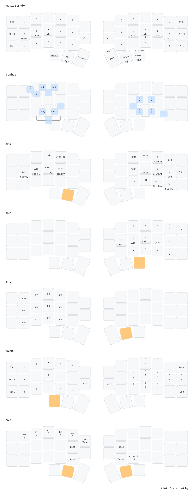

# ZMK Configuration - Corne Choc Pro

Personal ZMK firmware configuration for the Corne Choc Pro (46-key) split keyboard.

## Hardware

- **Keyboard**: Corne Choc Pro by Keebart
- **Keys**: 46 keys (3×7 + 3 thumbs per side)
- **Layout**: MagicSturdy (custom Sturdy variant)
- **Features**: nice!view displays, ZMK Studio support

## Keymap



## Building

Firmware builds automatically via GitHub Actions on push. Download the latest firmware from the [Actions](../../actions) page.

### Local Build

```bash
# Initialize west workspace
west init -l config
west update

# Build firmware
west build -s zmk/app -d build/left -b corne_choc_pro_left -- -DZMK_CONFIG="$(pwd)/config"
west build -s zmk/app -d build/right -b corne_choc_pro_right -- -DZMK_CONFIG="$(pwd)/config"
```

## Keymap Visualization

Generate the keymap drawing:

```bash
# Activate Python environment
source .venv/bin/activate

# Parse and draw
keymap -c draw/config.yaml parse -z config/corne_choc_pro.keymap > draw/keymap.yaml
keymap -c draw/config.yaml draw draw/keymap.yaml > draw/keymap.svg
```

## Features

- **Adaptive Keys**: Context-aware key behaviors using urob's zmk-adaptive-key
- **ZMK Studio**: Live keymap editing via nice!view displays
- **Multiple Layers**: Base, Navigation, Numbers, Symbols, and more

## Credits

- Layout inspiration: [urob/zmk-config](https://github.com/urob/zmk-config)
- Keymap visualizations: [caksoylar/keymap-drawer](https://github.com/caksoylar/keymap-drawer)
